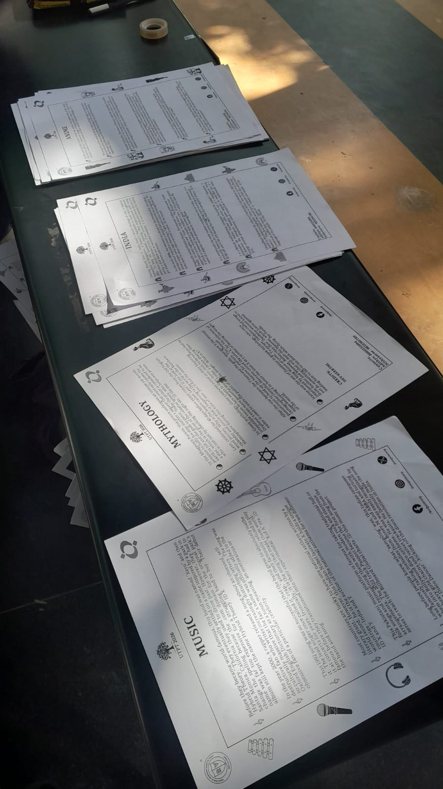
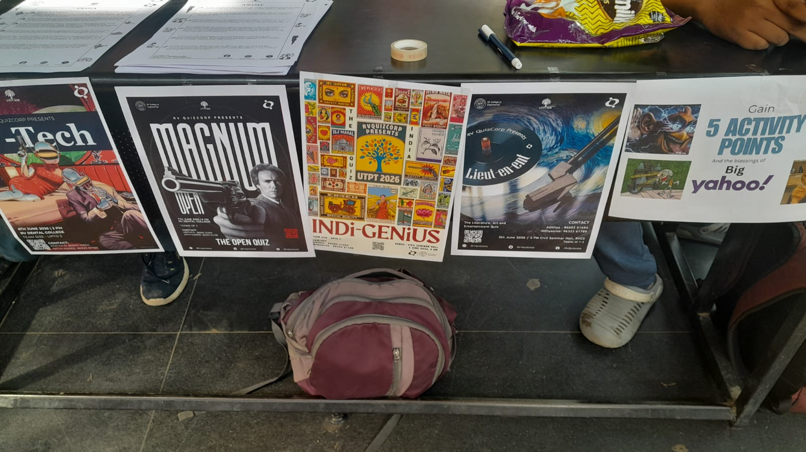
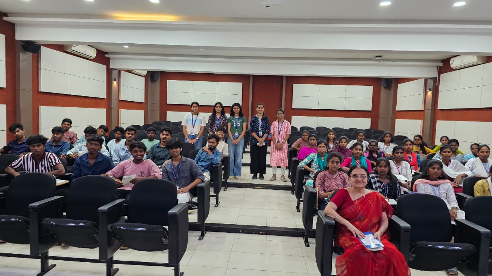
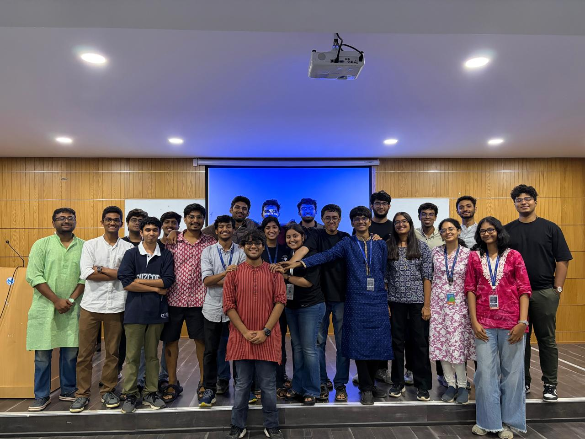

# UTPT-2026

The Quiz Corp annual quiz fest is in around 2 days. We had to make designs, co-ordinate with our juniours to make informals,
in which i was the head of anime informals.We have been marketing from last friday. I thought it would be fun, i mean sure it is,
but also yea oof. Today morning i had to go talk to the girl that rejected me and tell her to register for utpt lol. Is my presence that 
repulsive though,i dunno. Anyways iv been having fun being with shreesha, jai, and hansel mostly.
This Rohith doesn't show up only half the time and when he does he goes full tsundere and be like i dont do marketing and all,
then proceeds to say UTPT south india's biggest quiz fest to some dude.  

We put up some brainrot poster that is getting more traction and we made a reel for utpt where im throwing a bag at shreesha, we had a lot of fun.
My own friends don't join for this bro when i tell them but today ved my goat told i dont care about activity points i wanna join litent. This man 🥲.

 
 

We had a session that Sattva had to take for rural students from Tamil Nadu, the core team came together after a  while, we had fun conducting 
the session and it helped that we had someone who speaks tamil.After the session, we brought sharngini a penguin in divinity. 
 

Friday : India quiz, i wear my kurta and come to college, morning only we meet veena maam, get the reg desk set up in front of ec. We were roaming here and there getting things, i uploaded the youtube videos with avik sir. Then i sat with drithi and had lunch before litent started.I was responsible for the slides for india finals and it was pretty nerve wrecking at the start. Oshi was sitting with me keeping scores. She knew the guy who was the president of madras quiz club. Then we were in between litent before we went and packed up with expert education. Got their standees, Rohith got them their refreshments for which i got milk :) Then night i shifted into pg. 

 
 
 

Saturday : Me nd vaudeva went in metro then bus early morning, reached then shreesha and me had to get print of answer sheets, we also went to california burritos 
that day, I met lakshmi who was probably the first girl who had so mush game knowledge very cool.We got kitkat from a very super senior we also 
met a very old member of qc who came on sunday. That day i came pg very late and ended up staying at jai's room cs vasudeva was asleep and i didnt have 
the biometrics. While sports quiz was going on we were framing the science and biztech quesitons. 
 
 
 

Sunday : This was the day of open quiz, we went in cab from pg, ate breakfast at benne dose and were actually late for the open quiz lol. I sat solo 
but didnt qualify. We went out and ate continuously at pakashala.While major's quiz was going on we were outside having fun taking all sorts of photos
and videos then we went to have dinner at dominoz nd went back to pg. 
 
 
 
 
 
 
 
 
 
